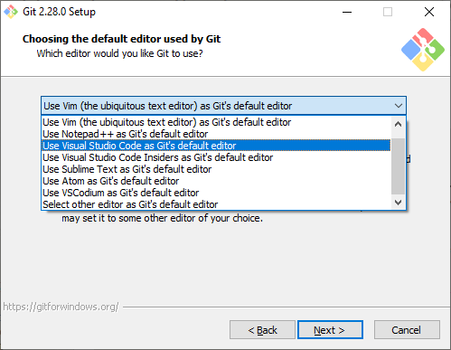

 
### Git _install_ 

* Á *Linux* og *Mackintosh*
  * Til að nota GIT er hægt að opna **Terminal** sem er innbyggt skipanalínuforrit 
  * Athugaðu hvort Git sé til með því að skrifa `$ git --version` í _"terminalinn"_

* Á *Windows 10* notum við forritið [**Git Bash**](https://git-scm.com/) 
_Git Bash_ er skipanalínuforrit  sem þýðir Linux skipanir yfir í Windows Dos skipanir, það er mikil hagræðing að geta notað sömu skipanir á mismunandi stýrikerfum.

* Opnið forritið Git Bash eða Terminal
  * Skráðu þig sem **&quot;--global&quot;** notanda  
  `$ git config --global user.name "Johndoe" `  
  (Johndoe = þitt **"notandanafn"** á Github, _með gæsalöppum_) 
  `$ git config --global user.email johndoe@example.com `  
  (Þitt tölvupóstfang sem þú notar á Github)

### Mikilvægar stillingar í Git Bash ( **Windows 10** )

1. Settu [**Visual Studio Code**](https://code.visualstudio.com/) forritið fyrst inn á tölvuna þína.
2. Síðan setur þú [**Git Bash**](https://git-scm.com/) inn á vélina

Samþykktu allar tillögur sem birtast þegar Git forritið er innsett

Veldu **Visual Studio Code** sem &quot;_default editor_&quot;

[https://git-scm.com/book/en/v2/Getting-Started-First-Time-Git-Setup](https://git-scm.com/book/en/v2/Getting-Started-First-Time-Git-Setup)