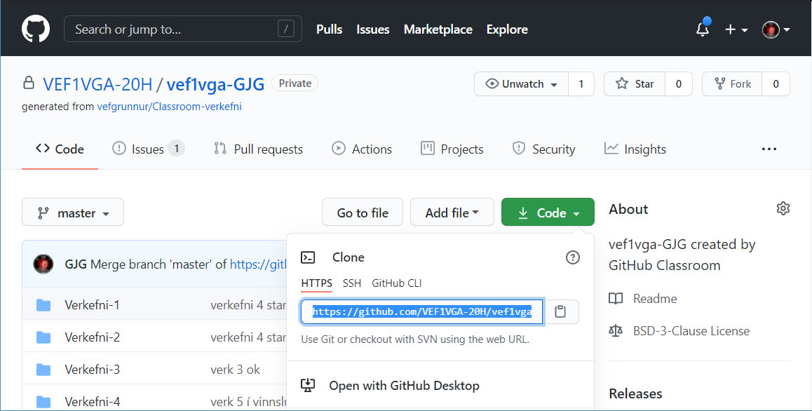

---
layout: default
title: Git verklag
---  

Nemendur geta hlaðið upp verkefnum (_upload files_) beint í verkefnamöppurnar en það er skynsamlegt að nota þær lausnir sem GIT og Github bjóða upp á. 

Til að vinna skipulega í verkefnum þarf að sækja áfangageymsluna af Github. Við tökum klón (_clone_) spegilmynd af áfangageymslunni yfir á okkar tölvu og vinnum öll verkefnin staðbundið (_local_).  Til þess er best að nota GIT.

  * Við speglum áfangageymsluna **"Clone Repository"** og vinnum með gögnin í geymslunni staðbundið (local)
    1. Smellið á Code hnappinn og afritið kóðann sem birtist í textareitinum  
     
    2. Opnið **Git Bash** og veljið hentugan stað til að setja áfangamöppuna í tölvunni  
    `$ cd ~/desktop/`  Skrifið _git clone_ og límið [Shift]+[insert] HTTPS kóðann inn  `$ git clone https://github.com/21VA1/21VA1-geymsla.git `
    3. Síðan er hægt að fara vinna í verkefnum áfangans. Munið að vista verkefnin reglulega í Git, `$ git add . ` 
    4. Verkefnum er síðan skilað með því að skrá `$ git commit -m 'skilaboð'`  og `$ git push` í  _Git bash_  
    5. Git er innbyggt í _Visual Studio Code_ forritið, þar notum við það í allri verkefnavinnu áfangans. 
  * Þegar yngri útgáfa skjals er í víðværri (_remote_) geymslu þá þarf að sækja það með skipuninni `$ git pull`
  * Ef maður er ekki viss hver staðan er þá er tjékkað á stöðunni með `$ git status`. 
  * Það er hægt að skrifa kóða beint í skjöl í Github geymslum, munið að vista skráninguna með _"Commit"_ 

  * Skjáfyrirlestur á Youtube: [Uppsetning _"local"_ áfangageymslu](https://youtu.be/PPwpF6yTX3Y) 
